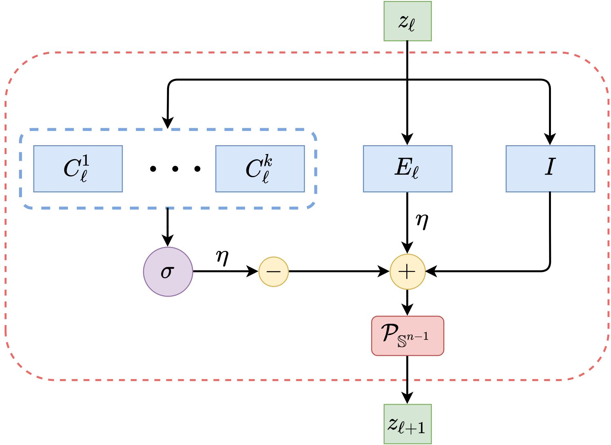

# Deep Networks from the Principle of Rate Reduction
This repository is the official implementation of the paper [Deep Networks from the Principle of Rate Reduction](https://arxiv.org/abs/2010.14765) (2021) by [Kwan Ho Ryan Chan](https://ryanchankh.github.io)* (UC Berkeley), [Yaodong Yu](https://yaodongyu.github.io/)* (UC Berkeley), [Chong You](https://sites.google.com/view/cyou)* (UC Berkeley), [Haozhi Qi](https://haozhi.io/) (UC Berkeley), John Wright (Columbia), and Yi Ma (UC Berkeley). 

## What is ReduNet?
ReduNet is a deep neural network construcuted naturally by deriving the gradients of the Maximal Coding Rate Reduction (MCR<sup>2</sup>) [1] objective. Every layer of this network can be interpreted based on its mathematical operations and the network collectively is trained in a feed-forward manner only. In addition, by imposing shift invariant properties to our network, the convolutional operator can be derived using only the data and MCR<sup>2</sup> objective function, hence making our network design principled and interpretable. 

<p align="center">
    <br>
	Figure: Weights and operations for one layer of ReduNet
</p>
<p align="center">

[1] Yu, Yaodong, Kwan Ho Ryan Chan, Chong You, Chaobing Song, and Yi Ma. "[Learning diverse and discriminative representations via the principle of maximal coding rate reduction](https://proceedings.neurips.cc/paper/2020/file/6ad4174eba19ecb5fed17411a34ff5e6-Paper.pdf)" Advances in Neural Information Processing Systems 33 (2020). 

## Requirements
This codebase is written for `python3`. To install necessary python packages, run `conda create --name redunet_official --file requirements.txt`.

## Core Usage and Design
The design of this repository aims to be easy-to-use and easy-to-intergrate to the current framework of your experiment, as long as it uses PyTorch. The `ReduNet` object inherents from `nn.Sequential`, and layers `ReduLayers`, such as `Vector`, `Fourier1D` and `Fourier2D` inherent from `nn.Module`. Loss functions are implemented in `loss.py`. Architectures and Dataset options are located in `load.py` file. Data objects and pre-set architectures are loaded in folders `dataset` and `architectures`. Feel free to add more based on the experiments you want to run. We have provided basic experiment setups, located in `train_<mode>.py` and `evaluate_<mode>.py`, where `<mode>` is the type of experiment. For utility functions, please check out `functional.py` or `utils.py`. Feel free to email us if there are any issues or suggestions. 


## Example: Forward Construction
To train a ReduNet using forward construction, please checkout `train_forward.py`. For evaluating, please checkout `evaluate_forward.py`. For example, to train on 40-layer ReduNet on MNIST using 1000 samples per class, run:

```
$ python3 train_forward.py --data mnistvector --arch layers50 --samples 1000
```
After training, you can evaluate the trained model using `evaluate_forward.py`, by running:

```
$ python3 evaluate_forward.py --model_dir ./saved_models/forward/mnistvector+layers50/samples1000 
```
, which will evaluate using all available training samples and testing samples. For more training and testing options, please checkout the file `train_forward.py` and `evaluate_forward.py`.

### Experiments in Paper
For code used to generate experimental empirical results listed in our paper, please visit our other repository: [https://github.com/ryanchankh/redunet_paper](https://github.com/ryanchankh/redunet_paper)

## Reference
For technical details and full experimental results, please check the [paper](https://arxiv.org/abs/2010.14765). Please consider citing our work if you find it helpful to yours:

```
@article{chan2020deep,
  title={Deep networks from the principle of rate reduction},
  author={Chan, Kwan Ho Ryan and Yu, Yaodong and You, Chong and Qi, Haozhi and Wright, John and Ma, Yi},
  journal={arXiv preprint arXiv:2010.14765},
  year={2020}
}
```

## License and Contributing
- This README is formatted based on [paperswithcode](https://github.com/paperswithcode/releasing-research-code).
- Feel free to post issues via Github. 

## Contact
Please contact [ryanchankh@berkeley.edu](ryanchankh@berkeley.edu) and [yyu@eecs.berkeley.edu](yyu@eecs.berkeley.edu) if you have any question on the codes.